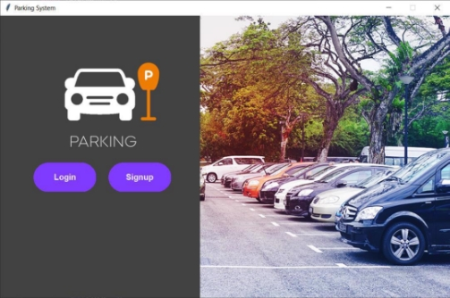
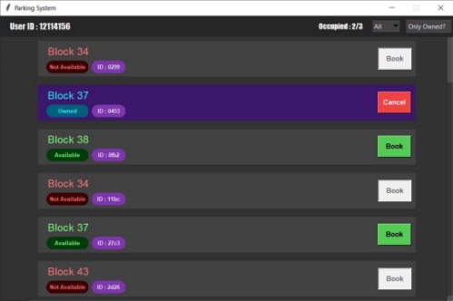
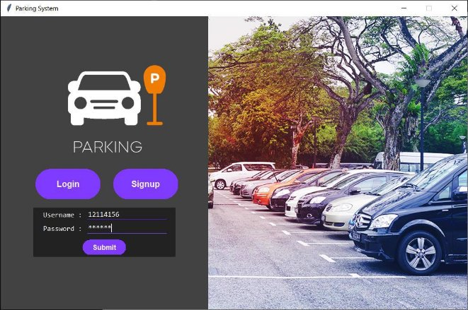
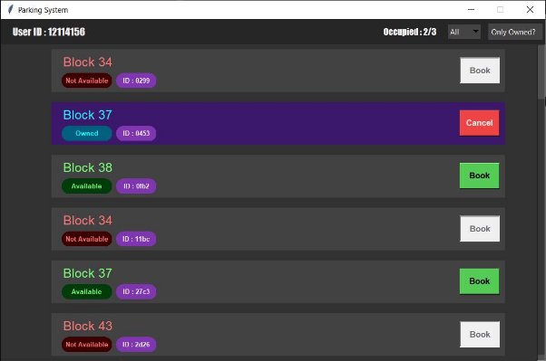
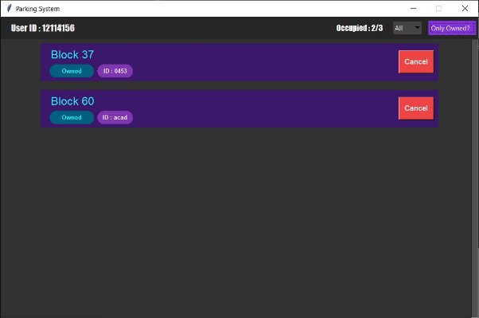

# **Introduction**

A python project to demonstrate a gui for a Parking Management System for an event using tkinter.

The project inherits widgets from tkiner classes and modify them to use accordingly.
 
 

# **DESIGN**

The GUI is divided into two parts:
- Start Screen
- Available Parking Screen 

## **Start Screen** 

The Start Screen component is to provide a interface for logging in or signing in. For both component there is a separate form and submitted respectively. 
 
 

` `  &nbsp; &nbsp; &nbsp;

## **Available Parking** 

This screen shows all types of parking spaces depending on option selected by the user. User can switch between Owned or All parking, check every block’s parking  &nbsp; &nbsp;separately or together. 

This screen also shows number parking spaces user has taken and every parking’s unique id. 

` `For each parking space information is shown in a custom card widget. Each card widget consists of parking’ s block name, availability, id and one assigned button 

 

 

**Cards** 

 

# **Screenshots** 

